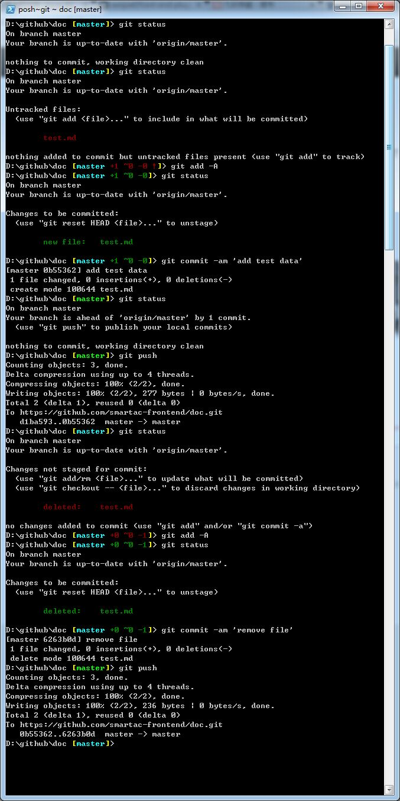

# GIT
## 版本控制
版本控制（Version Control）的作用是追踪文件的变化。为什么需要版本控制？简单说，就是当你出错了，可以很容易地回到没出错时的状态。

## GIT是什么
Git是目前世界上最先进的分布式版本控制系统（没有之一）

## 为什么使用GIT
Git有很多优势，其中之一就是远程操作非常简便，以及速度快。

## 使用
### 安装GIT软件
推荐使用Github的客户端 [windows 版下载](https://windows.github.com/)。

###  常用命令
* 检出仓库 `git clone /path/to/repository`
* 获取更新，并与本地代码进行合并 `git pull`
* 将文件添加到版本控制系统 `git add filePath`
	* `git add .` 添加当前目录下的所有文件
	* `git add -A` 添加当前目录下的所有文件，如有重命名的文件，会对重命名前的文件进行删除。`git add .`不会
* 提交改动代码 `git commit -m filePath "注释"` 注意:注释是必填的
* 提交所有改动代码 `git commit -am "注释"`
* 查看当前项目代码的状态 `git status`
* 将改动推送到服务器 `git push`
* 将文件的内容替换成上次提交时候的内容 `git checkout filePath`
* 将还没提交的内容保存起来，所有的文件内容变成上次提交时的样子 `git stash`
* 回复上次`git stash`的内容，并与当前代码进行合并 `git stash pop`
* 分支操作
	* 切换到某分支 `git checkout branchName`
	* 创建并切换到某分支 `git checkout -b branchName`
	* 将某分支的改动推送到服务器 `git push origin branchName`
* 发生冲突时，文件中会用 `>>>>` 和 `<<<<` 来标明冲突的地方。合并好后，`git add 这个冲突的文件`。 然后再commit,push



## .gitignore
如果项目想让某些文件的版本不受Git管理，可以在项目的根路径创建个文件，名称为 `.gitignore`。内容为不受Git管理的文件名。 如
```
.idea
Desktop.ini
*.log
# 开头表示注释，如果相匹配 #，可以在前面加一个反斜杠，即 \#
```

一些`.gitignore`的模板 https://github.com/github/gitignore

[用对 gitignore](http://www.barretlee.com/blog/2015/09/06/set-gitignore-after-add-file/)。[更多gitignore规则](https://git-scm.com/docs/gitignore)

## 配置别名
```
git config --global alias.st status
git config --global alias.pl pull
git config --global alias.aa 'add -A'
git config --global alias.ci commit
git config --global alias.ca 'commit -am'
git config --global alias.ph push
```

## Github表情符
在Github中可以在 Pull Requests, Issues, 提交消息, Markdown 文件里加入表情符。使用方法 :name_of_emoji:

如输入
```
:smile: :flushed: :sleeping:
:sunny: :snowman: :full_moon:
:ghost: :camera: :calendar:
```

输出    
:smile: :flushed: :sleeping:    
:sunny: :snowman: :full_moon:    
:ghost: :camera: :calendar:    

## 提交说明
* [Commit message 和 Change log 编写指南](http://www.ruanyifeng.com/blog/2016/01/commit_message_change_log.html)

## 常见问题
### 如何配置Git支持对文件名的大小写敏感
方案一是设置Git大小写敏感
```
git config core.ignorecase false
```


## <a name="practice">练习</a>
1. 安装[Github](https://github.com/)的客户端 [windows 版下载](https://windows.github.com/)
1. 注册Github的账号
1. 创建一个名为`front-end-learn` 的项目
1. 在该项目中创建一个`README.md` 提交代码,流程如下
    1. 检出仓库
    1. 将README.md文件添加到版本控制系统
    1. 提交README.md
    1. 将改动推送到服务器
1. 修改`README.md`的内容 提交代码,流程如下
    1. 提交README.md
    1. 将改动推送到服务器

注：Github的客户端包含图形界面和命令行（Git Shell）界面。虽然他们都包含一样的功能，但推荐使用命令行来完成上面的工作。

## 实战
* [githug](https://github.com/Gazler/githug) 闯过 55 个关卡，你就掌握 Git 啦~ [介绍](http://segmentfault.com/a/1190000004222489)

## 拓展阅读
* [猴子都能懂的Git入门](http://backlogtool.com/git-guide/cn/)
* [git-recipes](https://github.com/geeeeeeeeek/git-recipes/wiki) 高质量的Git中文教程
* [Git 及托管商 Github 的使用](https://github.com/xirong/my-git)
* [版本控制入门插图教程](http://www.ruanyifeng.com/blog/2008/12/a_visual_guide_to_version_control.html)
* [git - 简明指南](http://rogerdudler.github.io/git-guide/index.zh.html)
* [史上最浅显易懂的Git教程！](http://rogerdudler.github.io/git-guide/index.zh.html)
* [GitHub秘籍](https://github.com/tiimgreen/github-cheat-sheet/blob/master/README.zh-cn.md)
* [《Git in Practice》作者访谈：关于Git的八个问题](http://www.infoq.com/cn/articles/interview-Mike-McQuaid-git-practice)
* [Linus Torvalds 传记 By 池建强](http://www.chenjunlu.com/2014/07/linus-torvalds-biography/)
