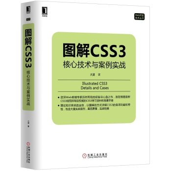

# 我的书
## CSS
  
图解CSS3 核心实战与案例实践

  
学习响应式设计

## JavaScript
  
JavaScript 框架设计

  
测试驱动的JavaScript 开发

  
精通D3.js：交互式数据可视化高级编程

## Node.js
  
深入浅出Node.js

## 算法
  
编程珠玑

## 设计
  
写给大家看的设计书

## 时间管理
  
番茄工作法图解 简单易行的时间管理方法 [读书笔记](note/pomodoro-technique-illustrated.md)

## 其他
  
程序员健康指南 [读书笔记](note/the-healthy-programmer.md)

  
图解机器学习

  
重来
